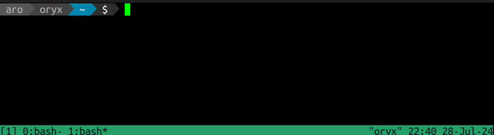

# OSP

**O**bnoxious

**S**lack

**P**erson



## Build
First, [get Zig](https://ziglang.org/download/) (`brew install zig` on Mac)

```
zig build
mv zig-out/bin/osp /somewhere/in/your/path
```

## Background

This is my first project playing around with Zig 😁️

If there's something I can do to be more idiomatic to the language or if there is a character you want to add, feel free to submit a PR!